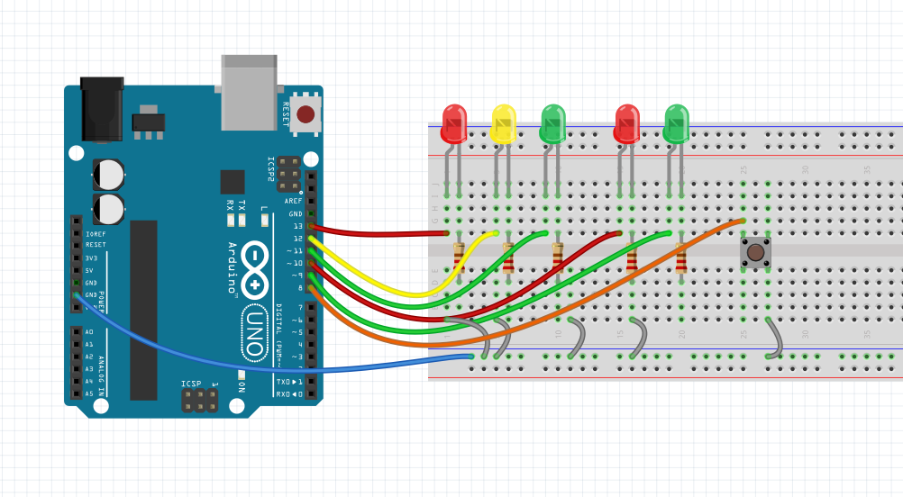

# Semáforo com botão para pedestre

Um projeto simples de uma semáforo de transito para arduíno

## Getting Started

Esse projeto é possível de executado com qualquer placa Arduíno que tenha 7 portas no mínimo. Execute o código por meio da IDE própria do Arduíno sem dificuldades.



### Pre requisitos

Os materiais necessários para a montagem do circuito estão listados abaixo

```
2 LEDs Vermelhos
1 LED Amarelo
2 LEDs Verdes
1 Botao do tipo Pullup
5 Resistores de 220Ω
12 Jumpers
```
